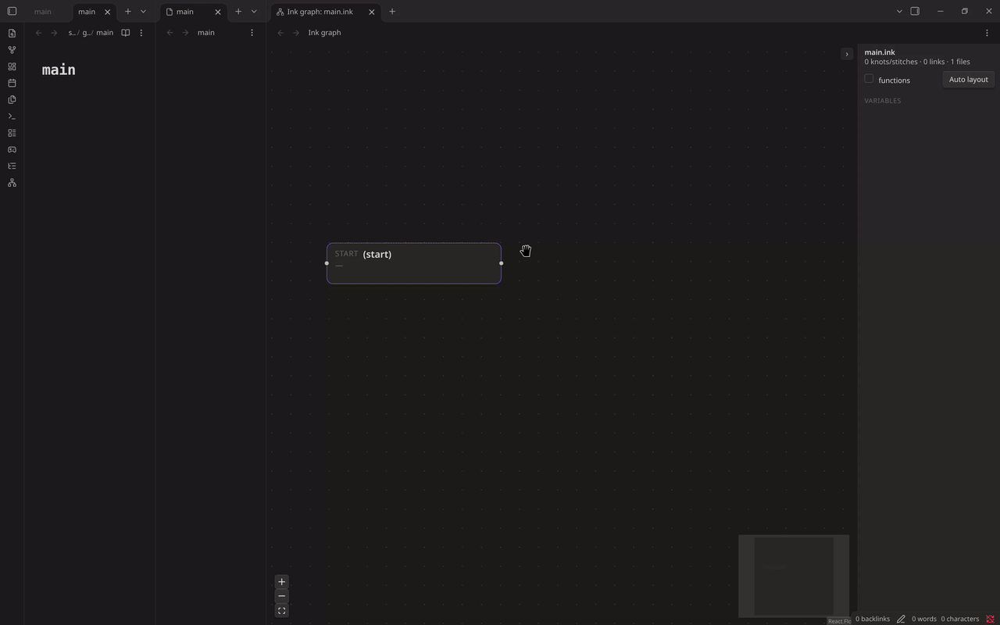
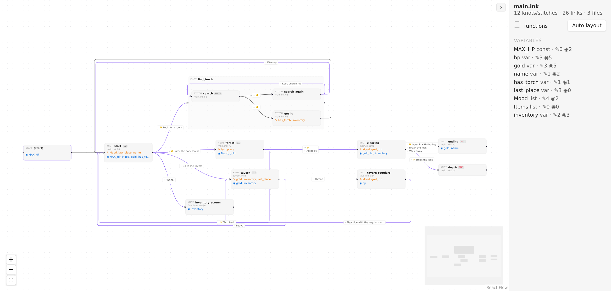
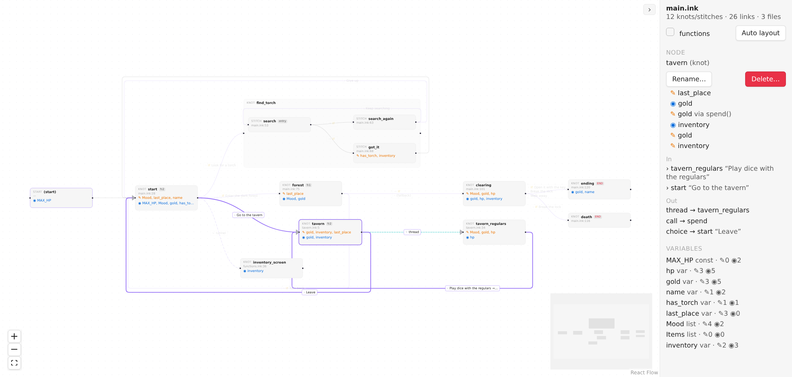
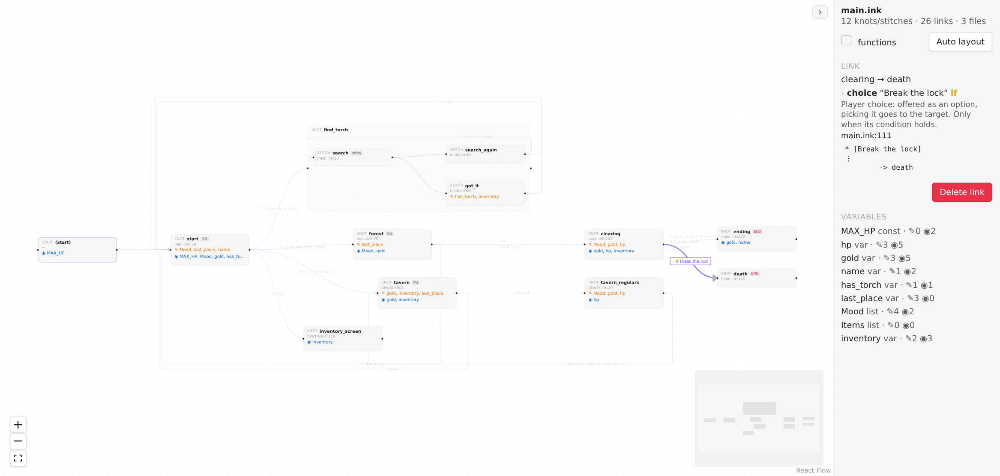
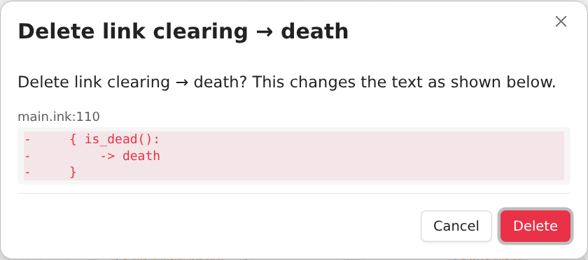
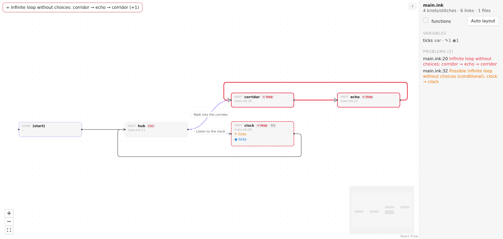
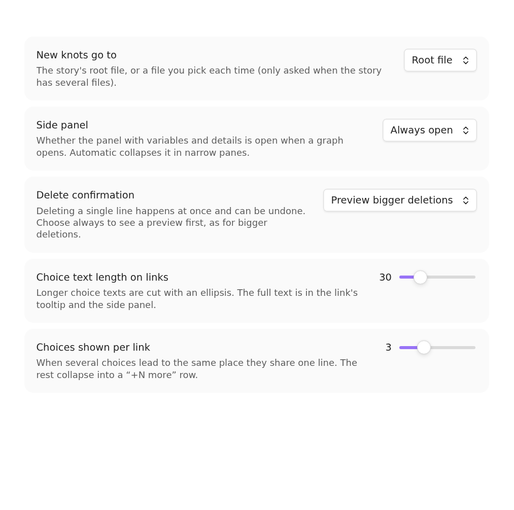

# Ink Graph

See and edit the structure of your [ink](https://github.com/inkle/ink) story inside Obsidian.
Ink Graph draws knots, stitches, choices, diverts, tunnels and threads as a map, shows where every variable is
read and written, warns about loops that would hang the story, and lets you change the story by working on the map.
Every action is written back to your `.ink` text, so nothing else stores your story.

<picture>
  <source media="(prefers-color-scheme: dark)" srcset="docs/img/overview-dark.png">
  
</picture>

## Features

- **A map of the story.** Knots with their stitches grouped inside, and every link between them: choices, diverts,
  tunnels, threads and function calls. Several choices between the same two knots share one line.
- **Variables at a glance.** Click a variable to light up the places that write it (orange) and read it (blue).
- **Loop warnings.** A cycle with no choice in it hangs the player. Ink Graph marks such cycles in red; a dashed outline
  means the loop is conditional and may be fine (a counter, for example).
- **Edit on the map.** Create knots and stitches, drag a link between two nodes (or out to empty space to create the node it leads to), rename, delete. Every edit is checked by
  recompiling the story first and is refused if it would add an error.
- **Details on demand.** Select a link to see its kind, its condition and every place it is written, with the source line.
- **Your layout is yours.** Positions are saved next to the story (`main.graph.json`), so they travel with it in git.

Works alongside [Ink Player](https://github.com/uglyboy-tl/obsidian-ink-player) and Ink Language. Ink Graph does not
register the `.ink` extension itself.

## Getting started

Open any `.ink` file and run the command **Open story graph** (or click the network icon in the left ribbon, "Open ink graph"). The story root is found by
following `INCLUDE`s upwards, so the graph covers every file the story includes.

| Do this | To get this |
|---|---|
| Double-click a node | Jump to its source line |
| Click a node or a link | Details in the side panel |
| Drag nodes | Move them (saved) |
| Right-click the canvas | New knot |
| Right-click a knot | Add stitch, rename, delete |
| Drag from a node's right handle to another node | Link: choice, sticky choice, divert or tunnel |
| Drag from a handle and let go on empty canvas | A new knot, linked from the node you started at (the `(start)` block works too: an empty story grows its first knot this way) |
| Drag from a handle and let go inside a knot's group | A new stitch in that knot, linked the same way |
| Delete or Backspace | Delete the selected node or link |
| Ctrl/Cmd+Z in the graph | Undo the last graph edit |

  
  

### Editing safely

- **Dropping a link on empty canvas** opens one small dialog for the new node's name and the kind of link. Esc, a click
  outside, the X or Cancel closes it without changing anything, and nothing opens if you let go outside the graph view.
  The node and its link are one change: a single undo takes back both.
- **Rename** updates every reference ink resolves to the node, across files: diverts, `knot.stitch` paths and read
  counts like `{knot > 1}`. Prose and comments are left alone.
- **The placeholder `-> END`** that a new knot or stitch starts with gives way to the first link you draw from it: a
  divert or a choice takes its place (a tunnel goes before it, since the story still ends there). Later links just add
  lines. An `-> END` that belongs to a choice's branch, or is not the node's last line, is never touched.
- **From the `(start)` block** a link becomes a line above the first knot. If the story already starts with a divert, that
  divert is named in the message: anything added after it would never run, so change that line instead.
- **Delete a node** removes its lines up to the next header (a knot goes with its stitches). Diverts and choices that led
  to it are redirected to `-> END`. Tunnels, threads, function calls, read counts and divert variables cannot be
  redirected, so the delete is refused and lists those places; click one to open it.
- **Delete a link** removes a choice as a whole when the link is its only exit. A divert among other content goes alone,
  together with an `{ condition: }` or `- else:` wrapper that would be left empty.
- Anything bigger than one line is shown as a diff first. A one-line delete happens at once and can be undone.

### Loops without choices

## Settings

| Setting | What it does |
|---|---|
| New knots go to | The story's root file, or a file you pick each time |
| Side panel | Open, closed, or automatic (collapsed in narrow panes) |
| Delete confirmation | Preview only bigger deletions, or always |
| Choice text length on links | Where long choice texts are cut |
| Choices shown per link | How many choices a link label lists before "+N more" |

## Installation

**From the community plugin list** (once it is accepted): Settings → Community plugins → Browse → search for Ink Graph.

**Manually**: download `main.js`, `manifest.json` and `styles.css` from the
[latest release](https://github.com/Alamion/obsidian-ink-graph/releases/latest) into
`<your vault>/.obsidian/plugins/ink-graph/`, then enable the plugin.

## Known limits

- The graph is rebuilt on the main thread (debounced), so very large stories may feel slow while you type.
- An unclosed `{` can swallow the lines after it while you are typing, so parts of the graph briefly disappear.
- Function calls and diverts through a variable (`-> x`) are shown but cannot be deleted from the graph.
- Delete and Backspace have no touch equivalent; use the menu or the panel buttons on a phone.

## Development

This repository is a monorepo (the plugin lives in `apps/obsidian-ink-graph`, the story parser and editor core in
`packages/ink-core`). See [docs/DEVELOPMENT.md](docs/DEVELOPMENT.md).

## License

[MIT](LICENSE)
